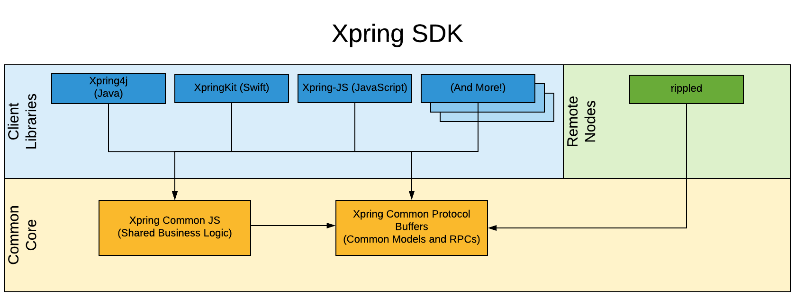

# Contributing

Thanks for considering a contribution to [Xpring SDK](https://github.com/xpring-eng/xpring-sdk)!

We're thrilled you're interested and your help is greatly appreciated. Contributing is a great way to learn about the [XRP Ledger](https://xrpl.org) and [Interledger Protocol (ILP)](https://interledger.org/). We are happy to review your pull requests. To make the process as smooth as possible, please read this document and follow the stated guidelines.

## About This Library



Xpring-JS is a JavaScript library that is shipped as a consumable artifact in NPM.

This library relies depends on both:
- [Xpring Common JS](http://github.com/xpring-eng/xpring-common-js): Common code shared across Xpring SDK in JavaScript.
- [Xpring Common Protocol Buffers](http://github.com/xpring-eng/xpring-common-protocol-buffers): Common protocol buffers shared across Xpring SDK.

## Requirements for a Successful Pull Request

Before being considered for review or merging, each pull request must:
- Pass continuous integration tests.
- Update documentation for any new features.
- Be free of lint errors. Please run `eslint` before sending a pull request.
- Be [marked as drafts](https://github.blog/2019-02-14-introducing-draft-pull-requests/) until they are ready for review.
- Adhere to the [code of conduct](CODE_OF_CONDUCT.md) for this repository.

## Building The Library

The library should build and pass all tests.

```shell
# Clone repository
$ git clone https://github.com/xpring-eng/xpring-js.git
$ cd xpring-js

# Install dependencies
npm i

# Install gRPC Web
## OSX
$ curl -L https://github.com/grpc/grpc-web/releases/download/1.0.7/protoc-gen-grpc-web-1.0.7-darwin-x86_64 --output protoc-gen-grpc-web
$ sudo mv protoc-gen-grpc-web /usr/local/bin/
$ chmod +x /usr/local/bin/protoc-gen-grpc-web
## Linux
$ curl -L https://github.com/grpc/grpc-web/releases/download/1.0.7/protoc-gen-grpc-web-1.0.7-linux-x86_64 --output protoc-gen-grpc-web
$ sudo mv protoc-gen-grpc-web /usr/local/bin/
$ chmod +x /usr/local/bin/protoc-gen-grpc-web

# Run tests.
$ npm test
```
