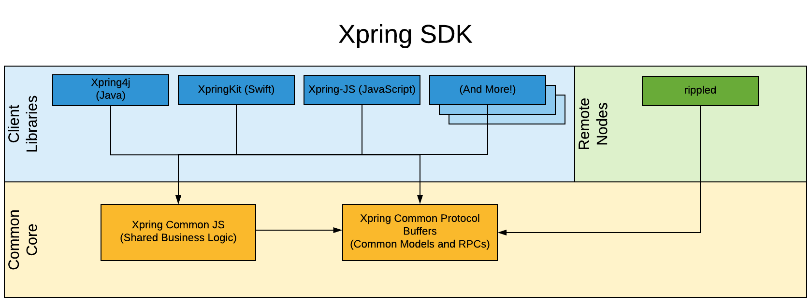

# Contributing

Thanks for considering a contribution to [Xpring SDK](https://github.com/xpring-eng/xpring-sdk)!

We're thrilled you're interested and your help is greatly appreciated. Contributing is a great way to learn about the [XRP Ledger](https://xrpl.org) and [Interledger Protocol (ILP)](https://interledger.org/). We are happy to review your pull requests. To make the process as smooth as possible, please read this document and follow the stated guidelines.

## About This Library



This library is made up of [protocol buffers](https://developers.google.com/protocol-buffers) which form common model objects for Xpring SDK. There are also [gRPC service definitions](https://grpc.io), which form a network interface for  Xpring SDK.

This library is widely consumed, including by:
- [Language Specific Libraries in Xpring SDK](https://github.com/xpring-eng/xpring-sdk#client-side-libraries)
- [Xpring Common JavaScript](https://github.com/xpring-eng/xpring-common-js)
- Xpring SDK's Server Side Component


Because this library is widely consumed, it must remain backwards compatible. In most cases, Xpring will be cautious to add new functionality as it increases the maintenance burden of backwards compatibility.

If you make a code change to this library, you are more than likely adding a new feature in one or more dependent libraries. Your [pull requests](#requirements-for-a-successful-pull-request) for all code changes should document how the new fields and functionality will be used.

## Requirements for a Successful Pull request

- Continuous integration tests pass on pull request.
- Documentation in pull request about how the new functionality will be used in client libraries.
- Pull request is free of lint errors. Please see [Google's Protocol Buffer style guide](https://developers.google.com/protocol-buffers/docs/style) and [Google's API design guidelines](https://cloud.google.com/apis/design/).
- Pull Requests are [marked as drafts](https://github.blog/2019-02-14-introducing-draft-pull-requests/) until they are ready for review.
- Text and comments of pull request adhere to the [code of conduct](CODE_OF_CONDUCT.md) for this repository.

## Building The Library

Any successful compilation of protocol buffers is sufficient to prove this library builds. By default, the protocol buffer compiler compiles to C++ code, which is what the continuous integration build for this library also uses.

The following commands should bootstrap a developer environment:
```
# Install Protocol Buffer Compiler
# OSX
$ brew install protobuf
# Linux
$ sudo apt install protobuf-compiler
# Otherwise, see: https://github.com/protocolbuffers/protobuf#protocol-compiler-installation

# Install gRPC
git clone -b $(curl -L https://grpc.io/release) https://github.com/grpc/grpc
cd grpc
git submodule update --init
make

# Install prototool linter
# OSX
brew install prototool
# Linux
$ curl -sSL \
  https://github.com/uber/prototool/releases/download/v1.8.0/prototool-$(uname -s)-$(uname -m) \
  -o /usr/local/bin/prototool && \
  chmod +x /usr/local/bin/prototool
# Otherwise, see: https://github.com/uber/prototool#installation

# Build the protocol buffers!
protoc --proto_path=./proto/ --cpp_out ./generated/  --grpc_out=./generated --plugin=protoc-gen-grpc=grpc/bins/opt/grpc_cpp_plugin ./proto/*.proto

# Run linter
$ prototool lint
```
